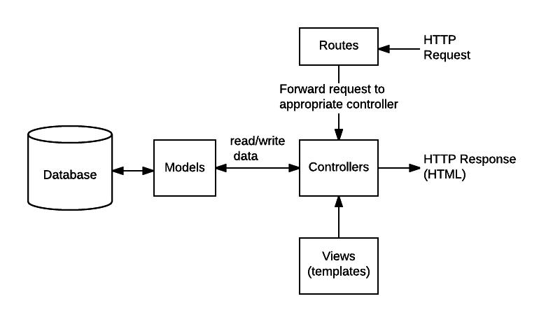

# bookstore-api

Hey guys, I'm Lucas.

This API is a simple bookstore to exercise the basic concepts of the Express framework. 

The idea is for a client to work with CRUD operations linked to a server that maintains a collection of books connected to a remote database.

Our REST API is based on the MVC architecture pattern. An architecture is a systematic way in which software is described.Serves as a blueprint for a system. MVC divides any large application into three parts:

1. The Model - Contains all the data-related logic that the user works with, like the schemas and interfaces of a project, the databases and their fields.
2. The View - Contains the UI and the presentation of an application. Things  that the user interacts with.
3. The Controller - Contains all the business-related logic and handles incoming requests. It is the interface between the Model and the View.

Our model is compound by Mongoose Schemas. Each schema maps to a MongoDB collection and defines the shape of the documents within that collection. It's a blueprint/model to our data.

We have Routes to foward requests to the apropriate controller function. A route is a section of Express code that associates an HTTP verb (GET, POST, PUT, DELETE, etc.), a URL path/pattern, and a function that is called to handle that pattern. These functions are the controllers.

